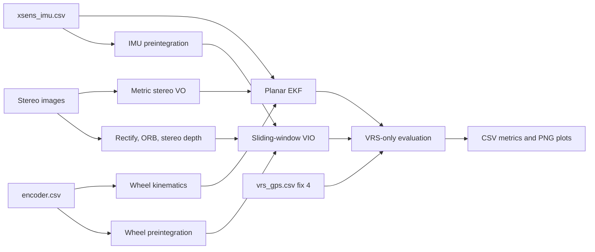

# Архітектура GPS-denied локалізації

## Режими

| Режим | Estimator | Сенсори |
|---|---|---|
| `base` | Planar EKF | IMU + wheel encoders |
| `visual` | Planar EKF з pose-clone update | IMU + wheels + stereo VO |
| `vio` | Sliding-window nonlinear optimization | IMU + wheels + stereo features |
| `all` | Запускає три конфігурації для порівняння | усі перелічені вище |

VIO є окремою траєкторією. IMU та колеса утворюють motion backbone, а camera
reprojection додається у спільну оптимізацію.

## Data flow

## Межі модулів

| Пакет | Відповідальність |
|---|---|
| `src/common/` | typed config, data contracts, timestamp merge |
| `src/dataset/` | dataset і calibration readers |
| `src/imu/`, `src/wheel/` | sensor adapters та wheel kinematics |
| `src/camera/visual_odometry.py` | окремий relative stereo VO frontend |
| `src/camera/vio.py` | features, preintegration, window optimization, VIO cache |
| `src/fusion/` | baseline EKF та orchestration |
| `src/evaluation/` | RTK matching, метрики й графіки |

## Baseline та VO

EKF state має вигляд `[x, y, yaw, speed, gyro_bias, accel_bias]`. IMU виконує
prediction, wheel speed і differential yaw rate виконують correction. Stereo VO
передає body-frame `dx,dy,dyaw`; pose-clone update порівнює цей increment зі
зміною стану. NIS керує covariance inflation та rejection.

## VIO

VIO state кожного camera epoch містить planar pose і forward speed. Спільні
змінні вікна містять gyro та accelerometer biases. Wheel factors обмежують
forward speed і yaw increment. Stereo disparity створює 3D
landmarks у попередньому camera frame; ORB tracks задають 2D observations у
наступному frame. Оптимізатор одночасно мінімізує reprojection та IMU residuals.

Початкова pose дорівнює `(0,0,0)`. Початкова швидкість ініціалізується wheel
preintegration. Після заповнення вікна найстаріша pose
фіксує локальний gauge, а estimator продовжує fixed-lag оптимізацію.

## Оцінка

Тільки `fix_state=4` використовується як reference. Для low-rate VIO estimate
інтерполюється на RTK timestamp, якщо сусідні states розділяє не більше 250 мс.
Global ATE застосовує один rigid SE(2) alignment без scale. Initial-pose view
вирівнює спільну стартову точку й напрям.

## Межі реалізації

Це feature-level VIO для planar vehicle model. Воно вже не стискає camera data
до готової VO pose до оптимізації, але не оцінює roll, pitch, gravity, повну 3D
velocity, camera-IMU time offset або extrinsics. Sliding window використовує
fixed-lag anchor замість Schur-complement marginalization. Для production VIO
потрібні повний 3D IMU state, covariance preintegration, marginalization і loop
closure.
