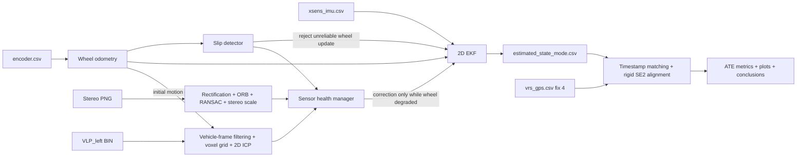

# Архітектура GPS-denied локалізації

## Призначення

Pipeline оцінює planar state автомобіля на `urban35` без GNSS measurement у
фільтрі. State EKF: `[x, y, yaw, v, gyro_bias, accel_bias]`. Вихід має локальний
початок і довільний початковий yaw. VRS-GPS застосовується після завершення
оцінювання тільки як незалежний position reference.

## Конфігурації

| Режим | Вимірювання у EKF |
|---|---|
| `base` | **E1:** IMU angular rate + wheel speed/course; `x,y` інтегрує EKF |
| `slip` | **E2:** Base + wheel/IMU disagreement detector і slip rejection |
| `visual` | E2 + guarded stereo relative translation/yaw |
| `lidar` | E2 + guarded VLP-16 ICP, camera data не читаються |
| `full` | E2 + guarded stereo VO та VLP-16 ICP |

## Data flow

Усі sensor events зливаються за nanosecond timestamp. За однакового timestamp IMU
обробляється першою, бо її потік передається першим до merger. EKF зберігає єдиний
runtime state; readers, frontends і evaluation його не змінюють.

## Модулі

| Пакет | Відповідальність |
|---|---|
| `src/main.py` | CLI entrypoint і CLI overrides |
| `src/common/` | Вкладені config dataclasses, data models і merge потоків за timestamp |
| `src/dataset/` | Загальні CSV checks, encoder/VRS readers і rigid calibration reader |
| `src/imu/` | Xsens IMU reader, вибір gyro/acceleration полів і SI sanity checks |
| `src/wheel/` | Counts → left/right speed, differential yaw, fault injection і slip detector |
| `src/camera/` | Stereo pairing, rectification, ORB, essential matrix і metric stereo scale |
| `src/lidar/` | VLP loader, calibrated points, voxel filter і 2D ICP |
| `src/fusion/` | EKF, health gating, experiment orchestration і CSV export |
| `src/evaluation/` | VRS matching, SE(2) alignment, ATE та plots |

## Конфігурація

`config/default.json` повторює межі підсистем. `general` містить dataset/output
paths і допустимий часовий крок; `evaluation` — VRS policy; `imu`, `wheel` та
`slip` — noise, NIS gates і detector parameters; `visual_odometry` та
`lidar_odometry` — параметри frontends; `fusion` — gates і fallback window для
relative motion. Loader перетворює кожну секцію на окремий immutable dataclass,
тому сенсорний модуль читає тільки власну групу параметрів.

## EKF та update contracts

IMU yaw rate й forward acceleration поширюють позицію, yaw та speed між
measurement epochs. Wheel speed спостерігає `v`, а differential-wheel
kinematics дає незалежний course constraint. Differential-wheel yaw rate,
stereo yaw rate і LiDAR yaw rate спостерігають `gyro_bias` через різницю з
поточним IMU gyro. Relative translation `dx / dt` спостерігає forward speed.
Поточна planar модель не використовує `dy` як окремий EKF measurement, але
зберігає його у frontend CSV і перевіряє motion bounds.

IMU-only experiment навмисно відсутній: `accel_x` має bias і не задає надійну
початкову лінійну швидкість, тому її інтегрування швидко дрейфує. E1 завжди
поєднує два базові джерела з порівнянною частотою близько 100 Hz.

Кожний scalar update обчислює innovation variance і NIS. Update вище порога не
змінює state. Joseph form підтримує симетричну додатну covariance. Під час
активного slip wheel speed/yaw updates пропускаються, uncertainty speed і
`gyro_bias` збільшується, а IMU prediction продовжується.

## Stereo visual odometry

Ліве та праве зображення паруються за однаковим timestamp, а не за індексом.
OpenCV calibration виконує rectification у половинній роздільності. ORB matches
між двома послідовними left frames проходять ratio test і RANSAC essential
matrix. Stereo disparity попереднього кадру дає metric scale. Для далеких сцен
translation sign essential matrix неоднозначний; `urban35` є forward-driving
sequence, тому frontend вибирає forward sign. Inlier count, speed, lateral motion
і yaw-rate bounds відкидають слабкі increments.

## LiDAR odometry

Left VLP-16 points перетворюються sensor-to-vehicle transform, фільтруються за
range/height і voxelized до 0.25 м. ICP вирівнює current scan у previous vehicle
frame. Найближчий wheel increment використовується лише як initial guess і gate
від переходу в неправильний локальний мінімум; результат update походить з ICP.
Через rolling acquisition VLP-16 planar yaw має систематичну похибку на швидкому
русі, тому його `yaw_std` навмисно великий. Translation лишається незалежною
геометричною перевіркою руху.

## Runtime data path

1. `dataset/readers.py` потоково читає headerless encoder/VRS CSV, а
   `imu/reader.py` читає Xsens IMU. Readers перевіряють units, формат і
   монотонність nanosecond timestamps.
2. `wheel/odometry.py` застосовує resolution і wheel diameters, ділить приріст
   count на фактичний `dt` та формує left/right speed, forward speed і yaw rate.
3. `common/synchronization.py` зливає sensor events за timestamp; IMU prediction та
   wheel correction працюють приблизно зі 100 Hz.
4. `wheel/slip_detection.py` порівнює wheel yaw/acceleration з IMU та debounce-ить
   degraded state. Під час degraded interval wheel update пропускається.
5. VO/ICP frontends обробляють власні raw files незалежно. Health manager подає
   їх у EKF лише у короткому degraded wheel interval; quality та NIS gates можуть
   відкинути correction без зміни state.
6. Після estimator run `evaluation/metrics.py` окремо читає VRS, виконує time matching,
   один rigid SE(2) alignment без scale fit і рахує whole-trajectory ATE.

## Порівняння з VIO та LIO

Поточна система loosely coupled: camera або LiDAR frontend спочатку оцінює
relative motion, а EKF отримує лише speed/yaw-rate correction. Feature residuals,
point residuals та їх cross-covariance з IMU state у fusion не передаються.

VIO спільно оптимізує reprojection residuals, IMU preintegration, pose, velocity
і biases. LIO використовує IMU для deskew LiDAR scan та спільно оптимізує motion
і scan residuals. Вони можуть бути точнішими, але потребують точної time/extrinsic
calibration, ініціалізації, більшого state і nonlinear optimization. Для цього
прототипу окремі frontends лишають pipeline простим і дозволяють явно показати,
коли зовнішнє вимірювання було прийняте або відкинуте.

## Evaluation

`vrs_gps.csv` читається тільки з `--validate`, після завершення EKF. Беруться
`fix_state=4`; кожна VRS epoch зіставляється з найближчим state у межах 50 мс.
Одна rigid Kabsch SE(2) transform узгоджує local origin і yaw з UTM. Масштаб не
оцінюється. RMSE, median, P95 і final error рахуються по всіх 169 matched epochs.

Це trajectory-shape accuracy для GPS-denied local estimator. Метрика не є online
absolute UTM accuracy, бо початкові UTM position та heading не задаються фільтру.

## Відмови та degraded behavior

- пропущений stereo/LiDAR frame зменшує кількість corrections, але не зупиняє EKF;
- невалідна calibration, немонотонний timestamp або IMU gap понад `max_dt_s`
  спричиняє явну помилку;
- слабкий VO/ICP increment відкидається frontend gate;
- measurement із високим NIS відкидається EKF gate;
- wheel/IMU disagreement активує slip state після трьох samples і повертає wheel
  updates після двадцяти healthy samples;
- VRS no-fix epochs не входять у primary metric.

## Результати

Звичайний `urban35` run: E1 Wheel+IMU має 4.153 м RMSE, E2 — 3.788 м. Guarded
VO приймає один correction і зберігає 3.788 м RMSE. Окремий E2 + LiDAR без
камер не має достатньо надійного ICP increment у degraded wheel interval, тому
correction не застосовується і
результат лишається на рівні E2. Це видно в `relative=used/available`, diagnostics
CSV і comparison plots.

Причина малого ефекту зовнішніх сенсорів: саме `urban35` є легкою послідовністю
для Wheel+IMU. Обидва базові потоки мають близько 100 Hz, рух переважно плавний,
а detector позначає slip лише у 20 із 17 387 wheel samples. E2 уже добре
відтворює форму траєкторії. Stereo VO та ICP тут є loosely coupled frontends,
а не VIO/LIO зі спільною оптимізацією та IMU deskew, тому їх постійне fusion
додавало більше шуму, ніж корисної інформації.
