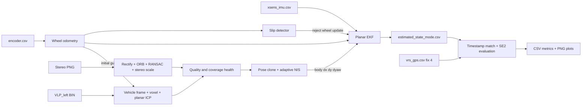

# Архітектура GPS-denied локалізації

## Призначення

Pipeline оцінює planar state автомобіля на `urban35` та `urban39` без GNSS
measurement у фільтрі. EKF state:

```text
[x, y, yaw, speed, gyro_z_bias, accel_x_bias]
```

Вихід має локальний початок і довільний початковий yaw. VRS-GPS читається лише
після estimator run як незалежний position reference.

## Режими

| Режим | Дані у fusion |
|---|---|
| `base` | IMU prediction + wheel speed і differential yaw |
| `slip` | Base + wheel/IMU disagreement detector |
| `visual` | E2 + continuous body-frame stereo `dx,dy,dyaw` |
| `lidar` | E2 + continuous body-frame ICP `dx,dy,dyaw` |
| `full` | E2 + LiDAR; VO заповнює лише прогалини LiDAR |

IMU-only experiment відсутній: acceleration bias робить подвійну інтеграцію
лінійної швидкості нестійкою. Базовий INS завжди використовує IMU та колеса з
порівнянною частотою близько 100 Hz.

## Data flow



Усі events зливаються за nanosecond timestamp. За однакового timestamp порядок
такий: IMU, wheel, relative measurement, pose epoch. Це дозволяє спочатку
застосувати increment між двома кадрами, а потім зберегти скориговану pose як
anchor наступного increment.

## Межі модулів

| Пакет | Відповідальність |
|---|---|
| `src/main.py` | CLI та path overrides |
| `src/common/` | Config dataclasses, data contracts, timestamp merge |
| `src/dataset/` | CSV readers і rigid calibration reader |
| `src/imu/` | Xsens gyro z / acceleration x reader |
| `src/wheel/` | Encoder calibration, wheel kinematics, slip detection |
| `src/camera/` | Stereo pairing, rectification, feature VO, cached reader |
| `src/lidar/` | VLP preprocessing, planar ICP, cached reader |
| `src/fusion/` | EKF, correlated pose clones, health policy, experiments |
| `src/evaluation/` | VRS matching, alignment, metrics, tables and plots |

`config/default.json` повторює ці межі секціями `general`, `evaluation`, `imu`,
`wheel`, `slip`, `visual_odometry`, `lidar_odometry` та `fusion`.

## Базовий EKF

IMU yaw rate і forward acceleration виконують prediction. Wheel speed
спостерігає `speed`. Differential wheel yaw rate разом з IMU gyro коригує
`gyro_z_bias`. Під час активного slip wheel corrections пропускаються, але IMU
prediction продовжується.

Scalar wheel updates використовують hard NIS gate. Covariance оновлюється у
Joseph form. Slip detector має debounce: три послідовні bad samples для входу
і двадцять good samples для виходу.

## Continuous relative-pose update

VO та LO оцінюють transform від попереднього кадру до поточного у vehicle body
frame:

```text
z = [dx_body, dy_body, dyaw]
```

На кожному frontend epoch EKF клонує попередню pose, її covariance та
cross-covariance з поточним state. Prediction relative pose обчислюється як:

```text
d_world = p_current - p_anchor
d_body  = R(yaw_anchor)^T d_world
dyaw    = wrap(yaw_current - yaw_anchor)
```

Innovation дорівнює measured minus predicted `[dx,dy,dyaw]`. Jacobian містить
поточну pose і anchor pose. Через cross-covariance relative measurement не
помилково сприймається як абсолютний GPS і не стискає довільні global origin та
yaw.

Спочатку рахується raw NIS. Якщо він перевищує soft threshold, measurement
covariance збільшується у `raw_nis / threshold` разів і update перераховується.
Масштаб обмежений значенням 100; більший outlier відкидається. Diagnostics
зберігають adapted NIS, covariance scale і факт застосування correction.

Frontend fusion активується тільки коли accepted increments покривають не
менше 30% послідовних пар. Це не дозволяє рідкісним локальним transforms
накопичувати bias як безперервна одометрія. У `full` режимі LiDAR має пріоритет,
бо VO та LO вимірюють той самий рух і не є незалежними. VO використовується у
прогалинах LiDAR.

## Stereo VO

Ліві та праві зображення паруються за точним timestamp. OpenCV calibration
виконує rectification. ORB matches проходять ratio test та RANSAC essential
matrix; disparity попереднього кадру задає metric scale.

Camera transform застосовується як повний SE(3) conjugation. До обертання
translation додається lever-arm term `t - R*t`; це важливо на поворотах, бо
camera розташована приблизно на 1.6 м попереду vehicle origin. Знак translation
узгоджується зі signed wheel motion hint.

## LiDAR odometry

Left VLP-16 points переводяться sensor-to-vehicle transform, фільтруються за
range/height та voxelized. ICP вирівнює current scan у previous vehicle frame.
Wheel motion використовується лише як initial guess і sanity gate.

На `urban39` scan-to-scan residuals дали приблизно 7 см RMS translation error і
кілька мілірадіан yaw MAD відносно wheel/FOG audit. Тому measurement uncertainty
задається від ICP quality, а решта outliers послаблюється adaptive NIS.

## Evaluation та графіки

`vrs_gps.csv` читається тільки з `--validate`. Беруться `fix_state=4`, кожна VRS
epoch зіставляється з найближчим state у межах 50 мс.

CSV містить дві оцінки:

1. **Global SE(2) ATE** — Kabsch translation і yaw по всіх matched points, без
   scale fit. Це primary metric форми траєкторії.
2. **Start anchored error** — використовується той самий fitted yaw, але
   translation фіксує перші точки разом. Саме його показують trajectory та
   error-over-time plots, тому старт estimate і reference збігається.

Start anchored plot є offline візуалізацією: fitted yaw використовує всю
reference trajectory. VRS та alignment ніколи не повертаються у EKF.

## Перевірені систематичні фактори

- encoder wheelbase з calibration дорівнює `1.52439 м`; усереднені wheel yaw,
  IMU та FOG узгоджуються приблизно в межах 1%, тому масштаб wheelbase не є
  причиною великої помилки;
- yaw handedness VO/LO, wheel та IMU однакова;
- camera/LiDAR rotation matrices ортонормальні, determinant близький до 1;
- LiDAR already transforms point clouds у vehicle origin; camera lever arm було
  додано окремо;
- Urban39 містить малий довготривалий yaw-rate offset. На 31-хвилинній
  послідовності він накопичується приблизно до 1.8 рад і пояснює сильну
  деформацію Wheel+IMU trajectory;
- natural slip detector активний лише 40 з 186674 wheel samples, тому slip не є
  основним джерелом Urban39 error.

## Обмеження та розвиток

Поточні frontends залишаються loosely coupled odometry. VIO спільно оптимізує
camera reprojection, IMU preintegration, velocity і biases. LIO додає IMU deskew
і point/plane residuals у scan-to-map estimator. Цей проєкт не має IMU deskew,
local map, loop closure або joint nonlinear optimization.

Наступні практичні кроки: LiDAR deskew, scan-to-map constraints, online
calibration noise/bias, повноцінний VIO, а для довгих петель — loop closure або
map constraint.
