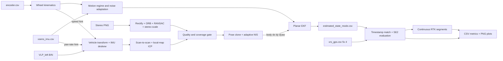

# Архітектура GPS-denied локалізації

## Призначення

Pipeline оцінює planar state автомобіля на `urban35`, `urban33` та `urban39`
без GNSS measurement у фільтрі:

```text
[x, y, yaw, speed, gyro_z_bias, accel_x_bias]
```

Локальна траєкторія має довільні origin та початковий yaw. VRS-GPS читається
лише після estimator run як незалежний reference.

## Режими

| Режим | Дані у fusion |
|---|---|
| `base` | IMU prediction + wheel speed і differential yaw |
| `visual` | Baseline + continuous stereo `dx,dy,dyaw` |
| `lidar` | Baseline + continuous VLP-16 `dx,dy,dyaw` |
| `full` | Baseline + LiDAR; VO заповнює прогалини LiDAR |

IMU-only experiment відсутній: acceleration bias робить подвійну інтеграцію
лінійної швидкості нестійкою. Baseline використовує complementary джерела:
колеса задають лінійну швидкість і кінематичний yaw rate, IMU задає швидку
динаміку та кутову швидкість.

## Data flow



Усі events зливаються за nanosecond timestamp. За однакового timestamp порядок
визначається порядком streams: IMU, wheel, relative measurement, pose epoch.
Після застосування increment поточна скоригована pose стає anchor наступного
frontend interval.

## Межі модулів

| Пакет | Відповідальність |
|---|---|
| `src/main.py` | CLI та path overrides |
| `src/common/` | Config dataclasses, data contracts, timestamp merge |
| `src/dataset/` | CSV readers і rigid calibration reader |
| `src/imu/` | Xsens gyro z / acceleration x reader |
| `src/wheel/` | Encoder calibration і differential wheel kinematics |
| `src/camera/` | Stereo pairing, rectification, feature VO, cache reader |
| `src/lidar/` | VLP preprocessing, deskew, ICP, local map, cache reader |
| `src/fusion/` | EKF, pose clones, adaptation, health policy, orchestration |
| `src/evaluation/` | VRS matching, alignments, segments, tables and plots |

`config/default.json` має окремі секції `general`, `evaluation`, `imu`, `wheel`,
`adaptation`, `visual_odometry`, `lidar_odometry` та `fusion`. Config parsing
відокремлений від runtime logic.

## Baseline EKF та online adaptation

IMU yaw rate і forward acceleration виконують prediction. Wheel speed
спостерігає `speed`; differential wheel yaw rate разом з IMU gyro спостерігає
`gyro_z_bias`.

Режим `straight` або `turning` визначається за модулем wheel та bias-corrected
IMU yaw rate. Для кожного режиму EKF незалежно підтримує EMA scales для speed
noise, yaw-rate noise та gyro-bias random walk. NIS поточного wheel measurement
визначає scale наступних measurements цього самого режиму. Scale обмежений
діапазоном 1–2. Поточний wheel outlier проходить hard NIS gate; його статистика
все одно збільшує недовіру до наступних samples.

Covariance оновлюється у Joseph form. Окремий binary slip state не
використовується: така класифікація майже не впливала на реальні sequences, а
NIS та regime-specific covariance вже обмежують ненадійні wheel corrections.

## Continuous relative-pose update

VO та LO оцінюють transform від попереднього кадру до поточного у vehicle body
frame:

```text
z = [dx_body, dy_body, dyaw]
```

На frontend epoch EKF зберігає pose, covariance та cross-covariance з поточним
state. Prediction relative pose:

```text
d_world = p_current - p_anchor
d_body  = R(yaw_anchor)^T d_world
dyaw    = wrap(yaw_current - yaw_anchor)
```

Innovation дорівнює measured minus predicted `[dx,dy,dyaw]`. Correlation із
pose clone враховується в innovation covariance, тому relative measurement не
стає помилковою абсолютною позицією.

Якщо raw NIS перевищує soft threshold, measurement covariance множиться на
`raw_nis / threshold`, і update перераховується. Scale обмежений 100; measurement,
якому потрібен більший scale, відкидається. Frontend входить у fusion лише коли
accepted increments покривають задану частку послідовних frame pairs. У `full`
режимі LiDAR має пріоритет, а VO використовується у його прогалинах, бо обидва
frontends вимірюють той самий рух і корельовані.

## Stereo VO

Ліві та праві зображення паруються за timestamp. OpenCV calibration виконує
rectification. ORB matches проходять ratio test і RANSAC essential matrix;
disparity задає metric scale.

Camera transform застосовується як SE(3) conjugation. Translation враховує
lever-arm term `t - R*t`; знак узгоджується зі signed wheel motion hint.

## LiDAR odometry

1. Left VLP-16 points переводяться sensor-to-vehicle transform.
2. IMU yaw rate та wheel speed переносять points у frame кінця scan.
3. Range/height filter і voxel grid зменшують point cloud.
4. Scan-to-scan ICP дає стійку локальну relative pose.
5. Scan-to-map ICP зіставляє current scan з картою останніх трьох scans.
6. Relative measurement є зваженою комбінацією обох оцінок; local-map pose
   також визначає координати нового scan у карті.
7. RMSE, inlier ratio, motion sanity gates та quality формують covariance.

VLP files містять `x,y,z,intensity` без per-point timestamps. Deskew тому оцінює
relative time за порядком point records і використовує scan period 0.1 с. Це
краще за припущення про одночасний scan, але поступається deskew з точними firing
timestamps. Local map коротка і не виконує loop closure або глобальну map
optimization.

## Evaluation та графіки

`vrs_gps.csv` читається тільки з `--validate`. Беруться `fix_state=4`; кожна VRS
epoch зіставляється з найближчим EKF state у межах 50 мс.

Рахуються дві whole-trajectory оцінки:

1. **Global SE(2) ATE** — Kabsch translation і yaw по всіх matched points, без
   scale fit. Це primary metric форми траєкторії.
2. **Initial-pose error** — translation фіксує перші точки, а yaw визначається
   за першим надійним відрізком близько 20 м. Ця метрика показує накопичений
   navigation drift без глобального підбору напряму.

Matched RTK epochs додатково діляться на безперервні segments за gap 1.5 с.
`rtk_segment_metrics.csv` містить duration, epochs, RMSE та final error кожного
segment. Це показує, які частини довгого маршруту реально покриті RTK. Alignment
і VRS не повертаються у EKF.

## Відомі обмеження

- Stereo VO є independent essential-matrix frontend без IMU preintegration.
- LiDAR local map не використовує surface normals, joint inertial state або
  loop closure.
- Global ATE може виглядати значно нижчим за initial-pose error, бо global fit
  компенсує один постійний yaw offset за всією траєкторією.
- RTK coverage має великі прогалини на `urban33` та `urban39`, тому whole-run
  RMSE описує тільки matched epochs.

Наступні кроки: VIO з IMU preintegration, point-to-plane LIO з точними firing
timestamps, loop closure або зовнішній map constraint для довгих міських
маршрутів.
