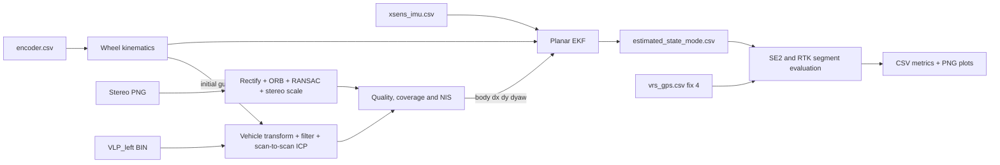

# Архітектура GPS-denied локалізації

## Призначення

Pipeline оцінює planar state автомобіля без GNSS measurement у фільтрі:

```text
[x, y, yaw, speed, gyro_z_bias, accel_x_bias]
```

VRS-GPS читається тільки після estimator run для незалежної оцінки.

## Режими

| Режим | Дані у fusion |
|---|---|
| `base` | IMU prediction + wheel speed і differential yaw |
| `visual` | Baseline + stereo `dx,dy,dyaw` |
| `lidar` | Baseline + scan-to-scan LiDAR `dx,dy,dyaw` |
| `full` | Baseline + LiDAR; VO заповнює прогалини LiDAR |

IMU-only режим не використовується: acceleration bias швидко руйнує оцінку
лінійної швидкості. Колеса дають speed і кінематичний yaw rate, IMU дає швидку
динаміку та angular rate.

## Data flow



## Модулі

| Пакет | Відповідальність |
|---|---|
| `src/main.py` | CLI та path overrides |
| `src/common/` | Config, data contracts, timestamp merge |
| `src/dataset/` | Dataset і calibration readers |
| `src/imu/` | IMU reader |
| `src/wheel/` | Encoder calibration та wheel kinematics |
| `src/camera/` | Stereo visual odometry |
| `src/lidar/` | VLP preprocessing та scan-to-scan ICP |
| `src/fusion/` | EKF, pose clones, gates та orchestration |
| `src/evaluation/` | VRS matching, metrics, RTK segments і plots |

Config розбитий на секції `general`, `evaluation`, `imu`, `wheel`,
`visual_odometry`, `lidar_odometry` та `fusion`.

## Baseline EKF

IMU yaw rate і forward acceleration виконують prediction. Wheel speed коригує
`speed`; differential wheel yaw rate разом з IMU gyro коригує `gyro_z_bias`.
Wheel updates використовують fixed configured covariance та hard NIS gate.
Covariance оновлюється у Joseph form.

Окремого slip detector немає. Він рідко активувався на реальних sequences та
іноді відкидав корисні wheel updates. Wheel outliers обмежує NIS gate.

## Continuous VO/LO update

VO і LO повертають transform між послідовними frames у vehicle body frame:

```text
z = [dx_body, dy_body, dyaw]
```

На попередньому frontend epoch EKF зберігає pose clone, covariance та
cross-covariance. Поточна pose перетворюється у frame anchor, після чого
innovation по `x,y,yaw` коригує state. Це зберігає relative характер
measurement і не перетворює VO/LO на абсолютну позицію.

Raw NIS вище soft threshold збільшує measurement covariance. Update повністю
відкидається, якщо потрібний covariance scale перевищує 100. Frontend входить у
fusion лише за достатнього coverage. LiDAR додатково потребує не менше 5% часу
з `|wheel yaw rate| >= 0.08 rad/s`; це non-GPS motion gate, який не дозволяє
накопичувати слабко спостережуваний yaw bias на майже прямому маршруті. У `full`
режимі LiDAR має пріоритет, а VO використовується у прогалинах, бо ці
measurements корельовані.

## Frontends

Stereo VO використовує rectification, ORB matching, RANSAC essential matrix,
stereo disparity scale та camera-to-vehicle transform. Простий frontend має
нестабільний scale і sequence bias.

LiDAR frontend запускається після sequence-level motion gate, переводить left
VLP-16 cloud у vehicle frame, фільтрує range і height, виконує voxel
downsampling та scan-to-scan planar ICP. Wheel motion використовується як
initial guess і sanity gate. Це стабільніше і простіше за коротку рухому local
map, але все одно накопичує drift і не є LIO.

## Evaluation та графіки

Беруться тільки VRS samples з `fix_state=4`; matching tolerance становить 50 мс.
Global SE(2) ATE використовує rigid alignment без scale fit. Графік траєкторії
має одну спільну стартову точку; початковий напрям визначається за першим
надійним відрізком близько 20 м. Завдяки цьому видно подальше розходження
траєкторій, а шум RTK під час стоянки не задає випадковий yaw.

RTK epochs також діляться на безперервні segments за gap 1.5 с. Segment metrics
не впливають на EKF і показують фактичне reference coverage, особливо для
`urban39`.

## Обмеження і наступний рівень

Прості VO та scan-to-scan LO не дають стабільного покращення baseline на всіх
sequences. Вони додають локальні relative measurements, але не усувають
систематичний yaw drift і не створюють глобального constraint.

Для вищої точності потрібен один із наступних підходів:

1. VIO з IMU preintegration та спільною оцінкою camera poses, velocity і biases.
2. LIO зі справжнім IMU deskew, point-to-plane scan-to-map optimization та
   local submap.
3. LVIO, яке спільно використовує camera, LiDAR та IMU.
4. Loop closure або зовнішній map constraint для корекції довготривалого drift.
