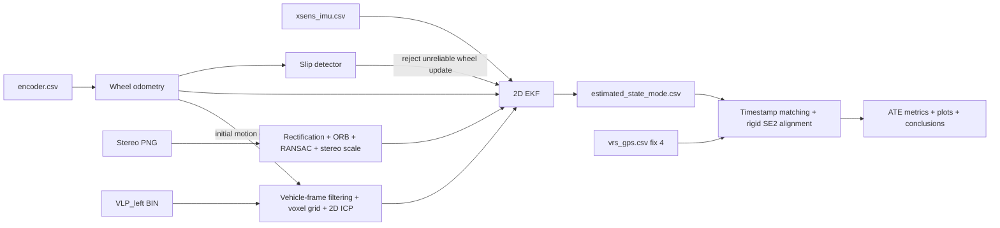

# Архітектура GPS-denied локалізації

## Призначення

Pipeline оцінює planar state автомобіля на `urban35` без GNSS measurement у
фільтрі. State EKF: `[x, y, yaw, v, gyro_bias, accel_bias]`. Вихід має локальний
початок і довільний початковий yaw. VRS-GPS застосовується після завершення
оцінювання тільки як незалежний position reference.

## Конфігурації

| Режим | Вимірювання у EKF |
|---|---|
| `base` | **INS baseline:** IMU predict + wheel-speed correction |
| `slip` | Base + differential-wheel yaw rate + slip rejection |
| `visual` | Slip + stereo relative translation/yaw |
| `full` | Visual + VLP-16 ICP relative translation/yaw |
| raw wheel comparator | Окреме differential-drive інтегрування без IMU та EKF |

## Data flow

Усі sensor events зливаються за nanosecond timestamp. За однакового timestamp IMU
обробляється першою, бо її потік передається першим до merger. EKF зберігає єдиний
runtime state; readers, frontends і evaluation його не змінюють.

## Модулі

| Модуль | Відповідальність |
|---|---|
| `src/config.py` | Paths, noise values, gates і frontend parameters |
| `src/dataset.py` | Headerless CSV readers, units і monotonic timestamp checks |
| `src/calibration.py` | Sensor-to-vehicle rigid transforms |
| `src/wheel_odometry.py` | Counts → left/right speed, differential yaw, wheel-only baseline, fault injection |
| `src/slip_detection.py` | Debounced wheel/IMU yaw та acceleration disagreement |
| `src/visual_odometry.py` | Stereo pairing, rectification, ORB matching, essential matrix, metric stereo scale |
| `src/lidar_odometry.py` | VLP binary loader, calibrated points, voxel filter, 2D ICP |
| `src/synchronization.py` | Stable multi-stream merge за timestamp |
| `src/ekf.py` | Predict, scalar updates, Joseph covariance update та NIS gates |
| `src/pipeline.py` | Experiment orchestration, CSV export, evaluation artifacts |
| `src/evaluation.py` | Valid RTK selection, nearest-time match, SE(2) alignment, ATE |
| `src/visualization.py` | Trajectory, error, RMSE, NIS і slip PNG |

## EKF та update contracts

IMU yaw rate й forward acceleration поширюють позицію, yaw та speed між
measurement epochs. Wheel speed спостерігає `v`. Differential-wheel yaw rate,
stereo yaw rate і LiDAR yaw rate спостерігають `gyro_bias` через різницю з
поточним IMU gyro. Relative translation `dx / dt` спостерігає forward speed.
Поточна planar модель не використовує `dy` як окремий EKF measurement, але
зберігає його у frontend CSV і перевіряє motion bounds.

Кожний scalar update обчислює innovation variance і NIS. Update вище порога не
змінює state. Joseph form підтримує симетричну додатну covariance. Під час
активного slip wheel speed/yaw updates пропускаються, uncertainty speed і
`gyro_bias` збільшується, а IMU prediction продовжується.

## Stereo visual odometry

Ліве та праве зображення паруються за однаковим timestamp, а не за індексом.
OpenCV calibration виконує rectification у половинній роздільності. ORB matches
між двома послідовними left frames проходять ratio test і RANSAC essential
matrix. Stereo disparity попереднього кадру дає metric scale. Для далеких сцен
translation sign essential matrix неоднозначний; `urban35` є forward-driving
sequence, тому frontend вибирає forward sign. Inlier count, speed, lateral motion
і yaw-rate bounds відкидають слабкі increments.

## LiDAR odometry

Left VLP-16 points перетворюються sensor-to-vehicle transform, фільтруються за
range/height і voxelized до 0.25 м. ICP вирівнює current scan у previous vehicle
frame. Найближчий wheel increment використовується лише як initial guess і gate
від переходу в неправильний локальний мінімум; результат update походить з ICP.
Через rolling acquisition VLP-16 planar yaw має систематичну похибку на швидкому
русі, тому його `yaw_std` навмисно великий. Translation лишається незалежною
геометричною перевіркою руху.

## Evaluation

`vrs_gps.csv` читається тільки з `--validate`, після завершення EKF. Беруться
`fix_state=4`; кожна VRS epoch зіставляється з найближчим state у межах 50 мс.
Одна rigid Kabsch SE(2) transform узгоджує local origin і yaw з UTM. Масштаб не
оцінюється. RMSE, median, P95 і final error рахуються по всіх 169 matched epochs.

Це trajectory-shape accuracy для GPS-denied local estimator. Метрика не є online
absolute UTM accuracy, бо початкові UTM position та heading не задаються фільтру.

## Відмови та degraded behavior

- пропущений stereo/LiDAR frame зменшує кількість corrections, але не зупиняє EKF;
- невалідна calibration, немонотонний timestamp або IMU gap понад `max_dt_s`
  спричиняє явну помилку;
- слабкий VO/ICP increment відкидається frontend gate;
- measurement із високим NIS відкидається EKF gate;
- wheel/IMU disagreement активує slip state після трьох samples і повертає wheel
  updates після двадцяти healthy samples;
- VRS no-fix epochs не входять у primary metric.

## Результати

Звичайний `urban35` run: E2 має 3.788 м RMSE проти 4.625 м raw wheel odometry. E3 знижує
P95 з 5.958 до 5.774 м, але RMSE зростає до 3.842 м. E4 має 3.844 м, тому LiDAR
не дає додаткового покращення на цій послідовності. Це обмеження видно у
comparison plots і явно збережено у висновках.
