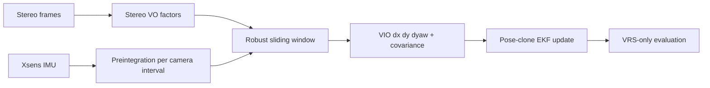

# Спрощений VIO: архітектура та межі

## Мета

Експериментальна гілка `feature/vio` додає visual-inertial odometry, сумісну з
наявним planar EKF. Вона перевіряє, чи IMU preintegration стабілізує stereo VO
scale та yaw без переписування всього fusion pipeline.

Це спрощений motion-factor VIO. Він оптимізує готові stereo relative-motion
factors разом з IMU factors. Він не виконує feature reprojection або bundle
adjustment усередині sliding window.

## Межі модулів

- `src/camera/visual_odometry.py` формує metric stereo `dx,dy,dyaw`.
- `src/camera/vio.py` виконує IMU preintegration і sliding-window optimization.
- `src/fusion/pipeline.py` керує режимами `visual`, `vio`, `lidar` і `full`.
- `src/fusion/ekf.py` приймає VIO як relative pose з source `vio`.
- `src/evaluation/` оцінює VIO тим самим VRS-only методом, що й інші режими.

## Data flow



## Sliding window

Вікно містить до восьми послідовних accepted stereo edges. Якщо між accepted
edges є camera gap, вікно очищується, щоб не створювати хибний velocity
continuity factor.

Для `N` edges оптимізуються:

```text
v_0 ... v_N, dyaw_0 ... dyaw_(N-1), gyro_bias, accel_bias
```

Residuals:

1. stereo forward speed проти середньої швидкості на edge;
2. IMU acceleration проти зміни швидкості;
3. stereo yaw increment;
4. IMU angular rate проти yaw increment і gyro bias;
5. priors для початкової швидкості та biases.

Оптимізація використовує `scipy.optimize.least_squares` із `soft_l1` loss.
Visual translation scale коригується optimized speed, але обмежується діапазоном
`0.5–2.0`. VIO yaw covariance поєднує visual та inertial uncertainty.

## Конфігурація

Секція `vio` в `config/default.json` задає:

- `window_size`;
- visual speed/yaw noise;
- IMU acceleration/gyro noise;
- gyro та acceleration bias priors;
- максимальну scale correction;
- мінімальне coverage для входу у EKF.

## Режими

- `--mode vio` порівнює baseline із VIO correction;
- `--mode all` додає окремий рядок VIO до повної ablation;
- `full` використовує VIO замість raw VO, якщо VIO coverage достатнє, та лишає
  LiDAR пріоритетним на спільних intervals;
- `--reuse-frontends` читає існуючий VO cache. Якщо VIO cache ще відсутній, він
  обчислюється з VO та IMU без повторного читання зображень.

## Обмеження

- Stereo factors уже стиснули feature information до однієї relative pose, тому
  оптимізатор не може повторно відкинути окремі feature outliers.
- Wheel speed використовується stereo frontend лише для знаку руху; VIO window
  не використовує wheel measurements.
- Planar state не оцінює roll, pitch, gravity direction або повний 3D motion.
- Marginalization замінена коротким moving window і bias prior.
- IMU measurement повторно присутній у downstream EKF prediction, тому VIO
  correction і EKF prediction частково корельовані.

Для повноцінного VIO наступним кроком є feature-level reprojection factors, 3D
IMU preintegration, camera-IMU extrinsic/time-offset estimation і proper
marginalization.

## Запуск

Перший VIO run із готовим stereo VO cache:

```bash
python -m src.main --mode vio --validate --reuse-frontends \
  --dataset data/complex_urban/urban33 \
  --output results/urban33
```

Повна ablation після створення `vio_odometry.csv`:

```bash
python -m src.main --mode all --validate --reuse-frontends \
  --dataset data/complex_urban/urban33 \
  --output results/urban33
```
