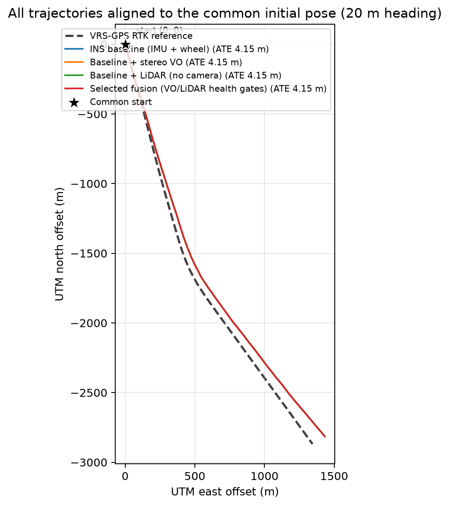
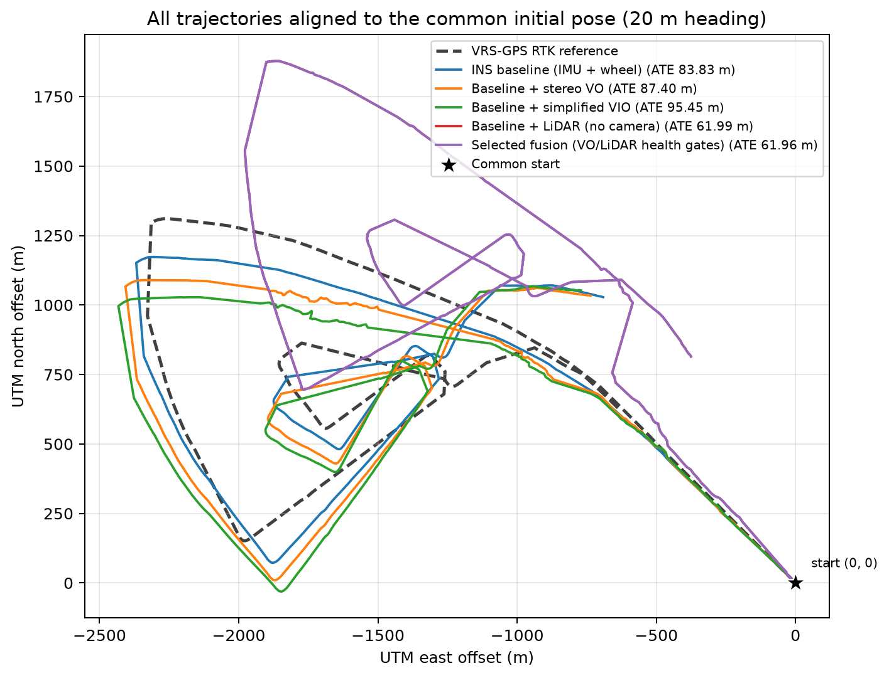
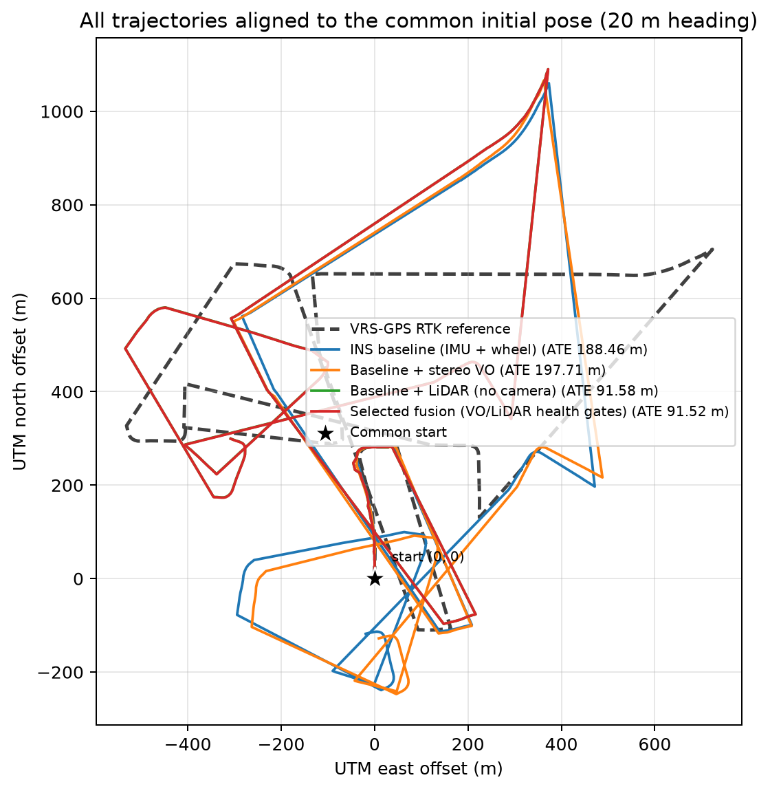

# Результати та висновки ДЗ 18–19

## Методика

VRS-GPS не входить у EKF. Для оцінки використовуються лише `fix_state=4`,
timestamp tolerance 50 мс і rigid SE(2) alignment без scale fit.

Графіки мають одну спільну стартову точку. Початковий напрям визначається за
першим надійним відрізком руху близько 20 м, тому подальше розходження показує
накопичений drift, а не довільний origin локальної системи координат.

Послідовності наведені від короткої до довгої:

| Sequence | Тривалість | Wheel distance | Valid RTK | RTK segments |
|---|---:|---:|---:|---:|
| `urban35` | 173.9 с | ≈3.2 км | 169 | 2 |
| `urban33` | 1284.4 с | ≈7.4 км | 908 | 12 |
| `urban39` | 1866.8 с | ≈10.7 км | 314 | 10 |

## Рекомендована конфігурація

`Selected fusion` застосовує VO/LO лише після health gates і автоматично
залишається у baseline degraded mode, коли додаткове джерело неінформативне.
Рішення приймається за wheel motion та frontend coverage без доступу до GPS.

| Sequence | Baseline RMSE | Selected fusion RMSE | Покращення |
|---|---:|---:|---:|
| `urban35` | 4.153 м | **4.153 м** | 0.0% |
| `urban33` | 83.828 м | **61.961 м** | 26.1% |
| `urban39` | 188.456 м | **91.522 м** | 51.4% |

Таким чином, selected policy не погіршує primary global RMSE на жодній із
трьох sequences. Повна ablation нижче показує, чому одного global числа все
одно недостатньо для оцінки navigation drift.

Поріг 5% є емпіричною policy для цього offline дослідження. Він не використовує
GPS під час вибору режиму, але його треба окремо перевірити на unseen sequences,
перш ніж вважати загальним правилом.

## Результати останнього повного прогону

### `urban35`

| Конфігурація | Global RMSE, м | Initial-pose RMSE, м |
|---|---:|---:|
| IMU + wheel baseline | **4.153** | **52.034** |
| Baseline + stereo VO | **4.153** | **52.034** |
| Baseline + LiDAR | **4.153** | **52.034** |
| Selected fusion | **4.153** | **52.034** |

VO не використовується через coverage 184/868, нижче порога 30%. LiDAR
вимикається до scan matching, бо лише 1.3% часу має
`|wheel yaw rate| >= 0.08 rad/s`, тоді як threshold становить 5%. Тому всі
режими коректно повертають baseline. До введення motion gate ungated LiDAR давав
127.396 м global RMSE: локально узгоджені ICP deltas накопичували yaw bias на
майже прямому маршруті.

### `urban33`

| Конфігурація | Global RMSE, м | Initial-pose RMSE, м |
|---|---:|---:|
| IMU + wheel baseline | 83.828 | **119.094** |
| Baseline + stereo VO | 87.403 | 160.181 |
| Baseline + LiDAR | 61.992 | 511.661 |
| Selected fusion | **61.961** | 511.606 |

VO погіршує обидві метрики. LiDAR зменшує global RMSE приблизно на 26%, але
initial-pose RMSE зростає більше ніж у чотири рази. Global alignment підбирає
поворот за всією траєкторією і приховує значну частину accumulated yaw error;
графік зі спільним стартом показує реальне розходження після поворотів.

### `urban39`

| Конфігурація | Global RMSE, м | Initial-pose RMSE, м |
|---|---:|---:|
| IMU + wheel baseline | 188.456 | 397.401 |
| Baseline + stereo VO | 197.715 | 412.400 |
| Baseline + LiDAR | 91.581 | 256.259 |
| Selected fusion | **91.522** | **256.203** |

LiDAR зменшує global RMSE приблизно на 51% та initial-pose RMSE на 36%. На цій
довгій послідовності з багатьма поворотами scan matching справді коригує частину
yaw drift. VO знову погіршує baseline, а selected fusion майже дорівнює
LiDAR-only, бо
LiDAR покриває 18505/18506 frame pairs і має пріоритет.

Valid RTK покриває лише близько 298 із 1867 секунд. Деталізація за десятьма
безперервними intervals наведена в
[`rtk_segment_metrics.csv`](urban39/rtk_segment_metrics.csv). Вона не підтверджує
точність на частинах маршруту без valid RTK.

## Як працює pipeline

1. Encoder counts і calibration дають left/right speed, forward speed та
   differential yaw rate.
2. IMU gyro z і acceleration x виконують EKF prediction.
3. Wheel speed та yaw rate коригують speed і gyro bias з fixed covariance та
   NIS gate.
4. Stereo VO оцінює body-frame `dx,dy,dyaw` через ORB, essential matrix і stereo
   scale.
5. LiDAR odometry фільтрує calibrated VLP-16 clouds і виконує scan-to-scan
   planar ICP. Wheel motion використовується як initial guess.
6. Перед LiDAR frontend motion gate перевіряє, що turning fraction не нижча 5%.
7. EKF порівнює VO/LO delta зі зміною від збереженої pose clone. За великим NIS
   covariance збільшується; сильний outlier відкидається.
8. Після fusion VRS-GPS використовується лише для метрик і графіків.

## Чому складніший frontend не покращив результат

- Baseline уже має стабільну лінійну швидкість від коліс і angular rate від IMU.
- Stereo VO має нестабільний metric scale, feature mismatches і sequence bias.
- Scan-to-scan LO накопичує drift, бо кожна нова pose залежить від попередньої.
- Коротка local map рухалася разом із помилковим wheel/IMU yaw і не створювала
  незалежного глобального constraint.
- Приблизний LiDAR deskew за порядком points не замінює точні firing timestamps.
- NIS обмежує окремі outliers, але не прибирає малий систематичний bias, який
  повторюється багато кадрів.
- VO, LO та wheel/IMU initial guess частково корельовані, тому додаткові updates
  не додають стільки незалежної інформації, як припускає простий EKF.

Через це online adaptation, approximate deskew і коротку local map прибрано з
фінального коду. Залишено простий fixed-noise baseline, scan-to-scan LO,
continuous relative-pose update та RTK segment evaluation. Така версія легша
для пояснення і відтворення, але її точність все одно обмежена.

## Висновок

Health-gated selected fusion не погіршує primary global RMSE: він зберігає
baseline на `urban35` і дає 26.1% та 51.4% покращення на `urban33/39`. Водночас
велика initial-pose error на `urban33` показує, що loosely coupled VO/LO не
гарантує точну довготривалу навігацію. Motion gate робить прототип стабільнішим,
але не виправляє systematic yaw drift.

Для реального підвищення точності потрібен хоча б один глобально або інерційно
узгоджений estimator:

1. **VIO** — camera reprojection + IMU preintegration + joint bias estimation.
2. **LIO** — exact LiDAR deskew + point-to-plane scan-to-map optimization.
3. **LVIO** — спільна оптимізація camera, LiDAR та IMU.
4. **Loop closure / map constraint** — корекція накопиченого drift на довгих
   маршрутах і петлях.
