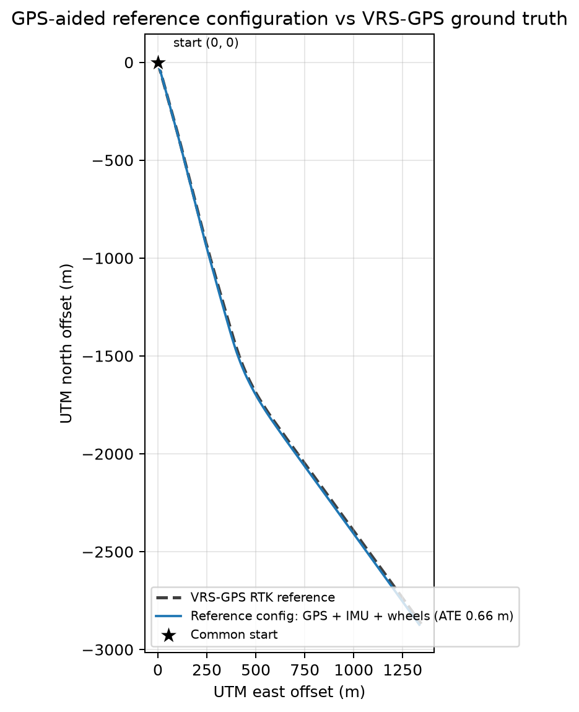
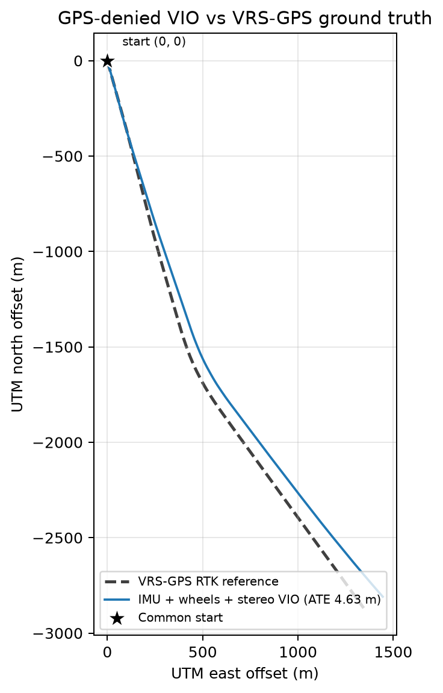
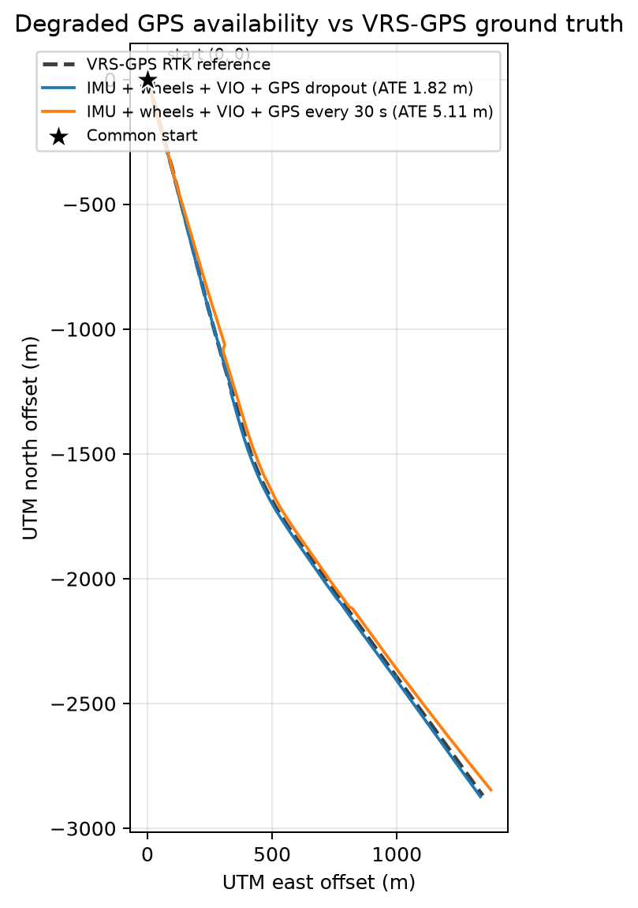
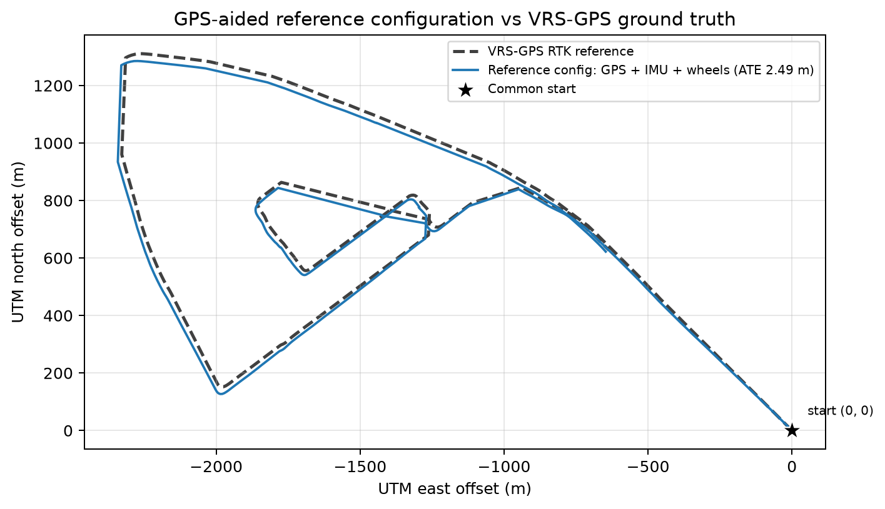
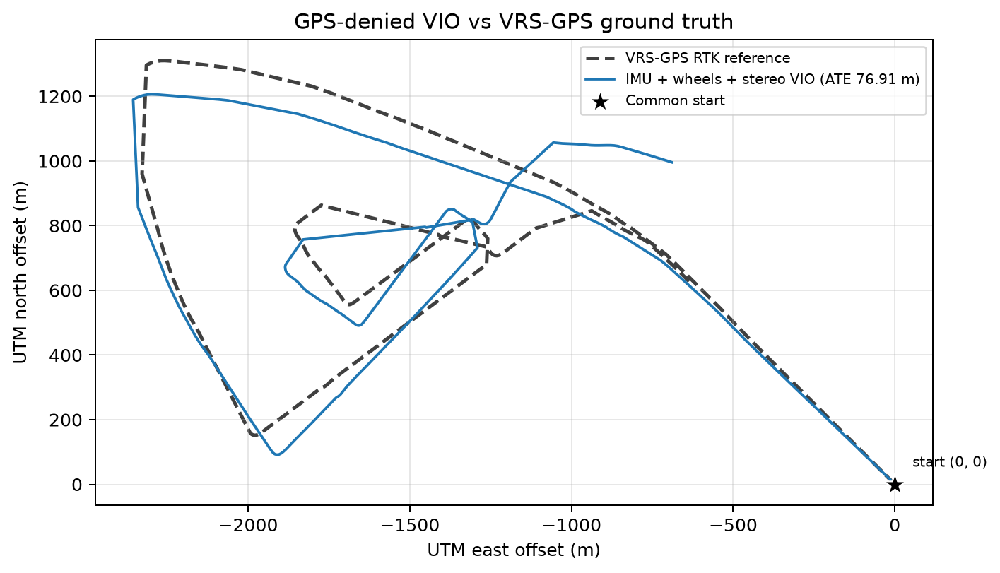
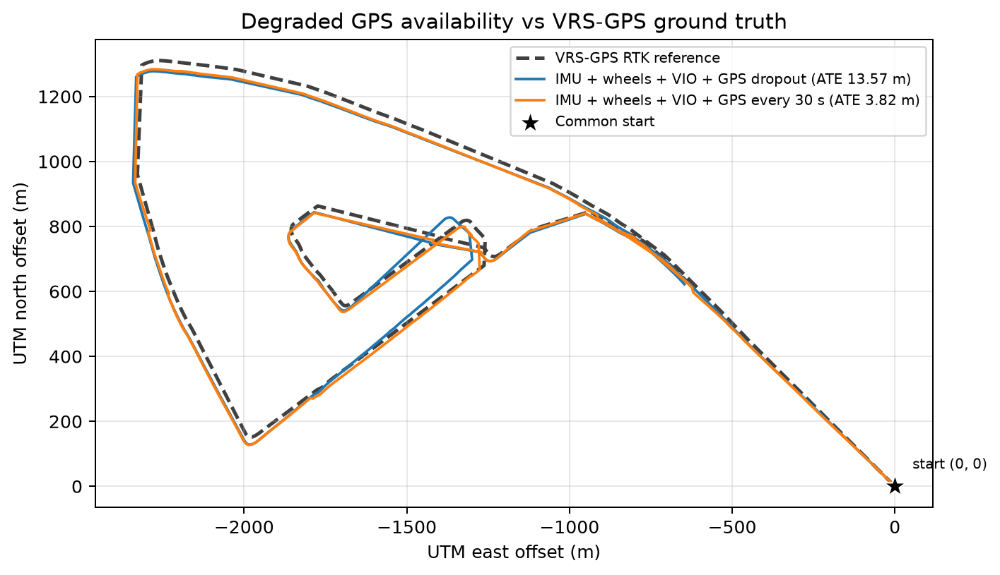
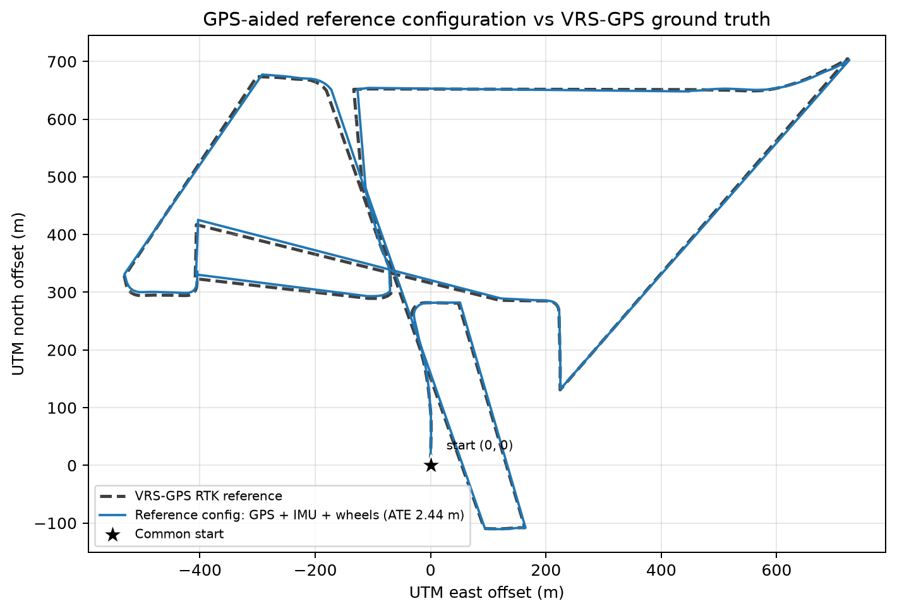
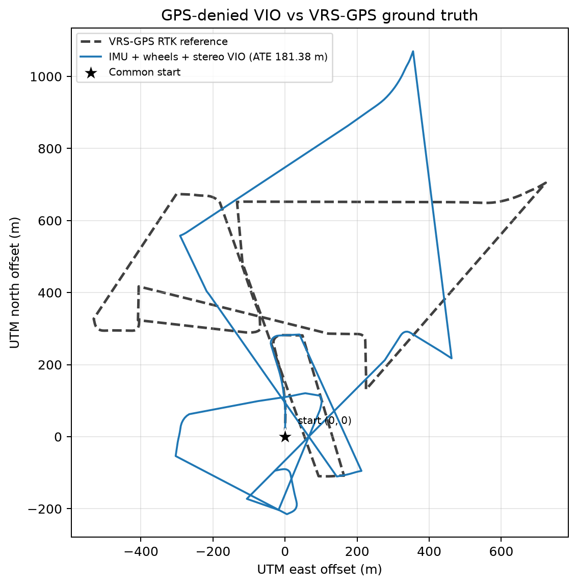
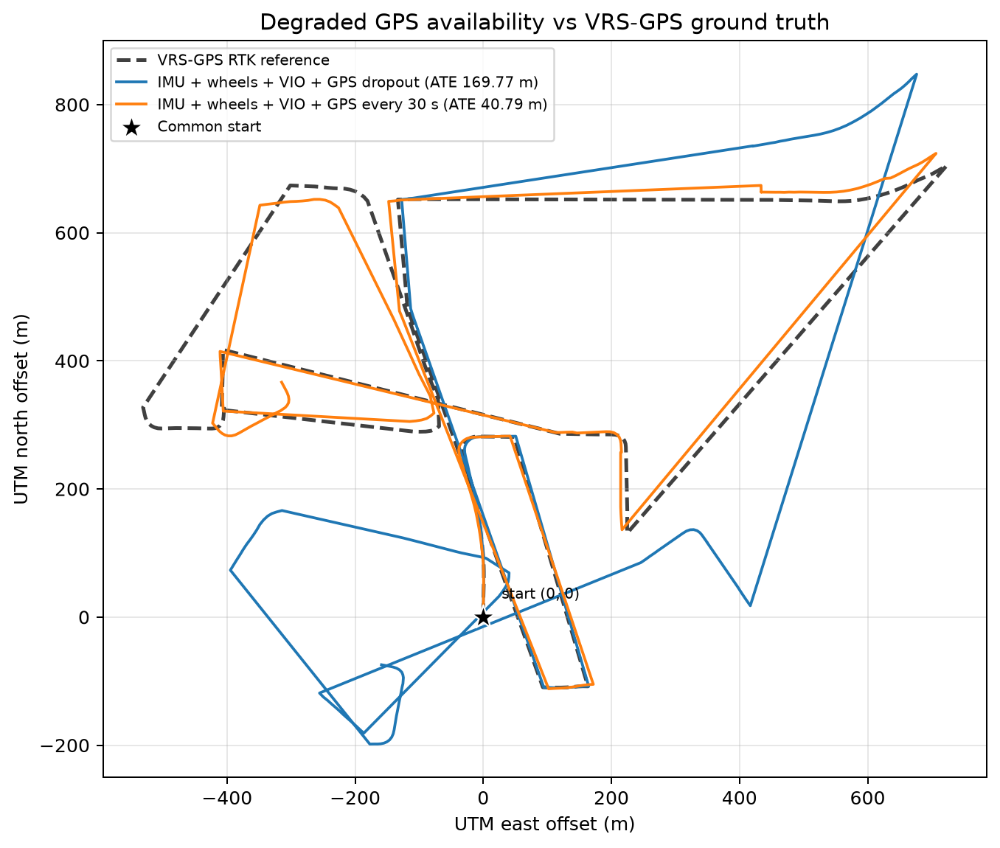

# Результати та висновки ДЗ 18–19

## Методика

Commercial GPS із `gps.csv` є вхідним сенсором GPS конфігурацій. Окремий
VRS-GPS із `vrs_gps.csv` не входить у жоден estimator і використовується як
ground truth. Primary metric — 2D ATE RMSE після rigid SE(2) alignment без
scale fit. Initial-pose RMSE додатково показує накопичення помилки напряму.

Порівнюються чотири конфігурації:

1. **GPS reference** — IMU + wheels + усі commercial GPS measurements.
2. **VIO** — IMU + wheels + feature-level stereo VIO без GPS.
3. **GPS dropout** — IMU + wheels + VIO; GPS відсутній на 20–40% та 50–70%
   пройденого шляху.
4. **Sparse GPS** — IMU + wheels + VIO; GPS надходить раз на 30 с.

У degraded GPS режимах VIO передає в EKF body-frame `dx, dy, dyaw`. GPS входить
як position update і через Kalman cross-covariance коригує pose, velocity,
gyro bias та accelerometer bias.

## `urban35`: короткий майже прямий маршрут

| Конфігурація | Global RMSE, м | Initial-pose RMSE, м | Final error, м |
|---|---:|---:|---:|
| GPS reference | **0.657** | **6.395** | **0.805** |
| VIO | 4.625 | 60.370 | 10.824 |
| GPS dropout | 1.825 | 6.557 | 1.145 |
| Sparse GPS, 30 с | 5.110 | 17.464 | 12.303 |

На короткому маршруті dropout майже не шкодить, бо INS/VIO не встигає сильно
відійти між доступними GPS ділянками. Sparse режим отримує лише 6 GPS samples,
з яких 5 є position updates. Global RMSE трохи гірший за VIO, але initial-pose
RMSE зменшується з 60.37 до 17.46 м: рідкі глобальні поправки помітно обмежують
помилку напряму, хоча їх недостатньо для рівномірної точності вздовж маршруту.

## `urban33`: середній маршрут із багатьма поворотами

| Конфігурація | Global RMSE, м | Initial-pose RMSE, м | Final error, м |
|---|---:|---:|---:|
| GPS reference | **2.487** | 21.277 | 2.678 |
| VIO | 76.907 | 102.373 | 324.985 |
| GPS dropout | 13.570 | 25.195 | 3.409 |
| Sparse GPS, 30 с | 3.823 | **22.276** | 10.886 |

На `urban33` чистий VIO накопичує значний yaw і position drift. GPS dropout
зменшує global RMSE приблизно на 82% відносно VIO, але помилка зростає всередині
довгих розривів. Sparse GPS дає 42 position updates і знижує RMSE до 3.82 м —
лише на 1.34 м гірше за GPS reference. Регулярні рідкі поправки тут ефективніші
за два довгі інтервали повної відсутності GPS.

## `urban39`: найдовший і найскладніший маршрут

| Конфігурація | Global RMSE, м | Initial-pose RMSE, м | Final error, м |
|---|---:|---:|---:|
| GPS reference | **2.442** | **4.093** | **1.291** |
| VIO | 181.380 | 392.598 | 150.178 |
| GPS dropout | 169.768 | 284.720 | 128.727 |
| Sparse GPS, 30 с | 40.789 | 43.262 | 95.191 |

На `urban39` довгі GPS outages дозволяють VIO drift стати занадто великим.
Після повернення GPS NIS gate відхиляє 4119 updates як несумісні, тому dropout
режим майже не відновлюється. У sparse режимі регулярні 30-секундні updates не
дають помилці зростати настільки швидко: прийнято 48 із 62 position candidates,
а RMSE зменшується на 77.5% відносно VIO. Водночас 30 с між поправками вже
недостатньо для точності рівня постійного GPS.

## Загальні висновки

- Повний commercial GPS утримує global RMSE в межах 0.66–2.49 м на всіх
  маршрутах.
- GPS-denied VIO прийнятний на короткому майже прямому `urban35`, але на
  `urban33/39` накопичує десятки й сотні метрів drift.
- Результат визначається не лише кількістю GPS samples, а й максимальною
  тривалістю без глобальної поправки. Регулярний GPS раз на 30 с кращий за довгі
  dropout intervals на складних маршрутах.
- На найдовшому маршруті потрібна recovery policy після outage: covariance має
  зростати під час відсутності GPS або estimator повинен дозволяти контрольовану
  relocalization замість постійного NIS rejection.
- Для GPS-denied роботи на довгих маршрутах потрібні повний 3D VIO з коректною
  IMU preintegration, loop closure або map constraints.
